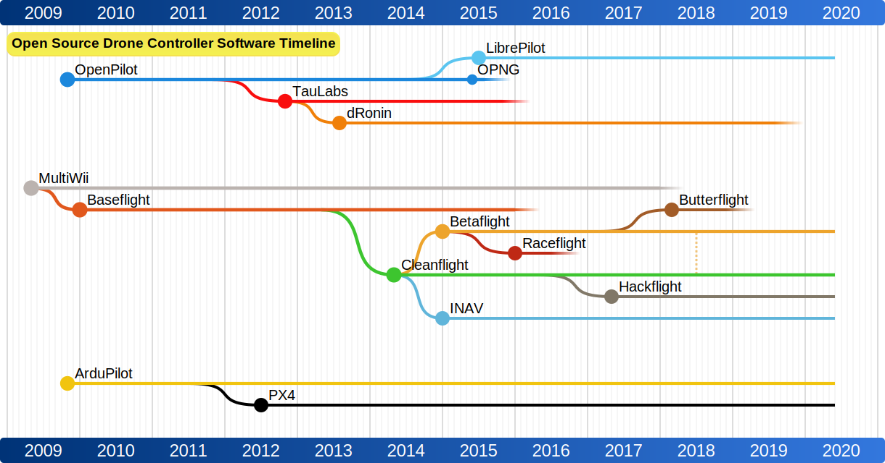

# Open Source Drone Software Timeline
This project is inspired by the project [LinuxTimeline](https://github.com/FabioLolix/LinuxTimeline) and using the same utility program [gnuclad](https://github.com/FabioLolix/gnuclad) to generate the cladogram.

### Usage
    gnuclad drone_software.csv SVG drone_software.conf

### The output cladogram

